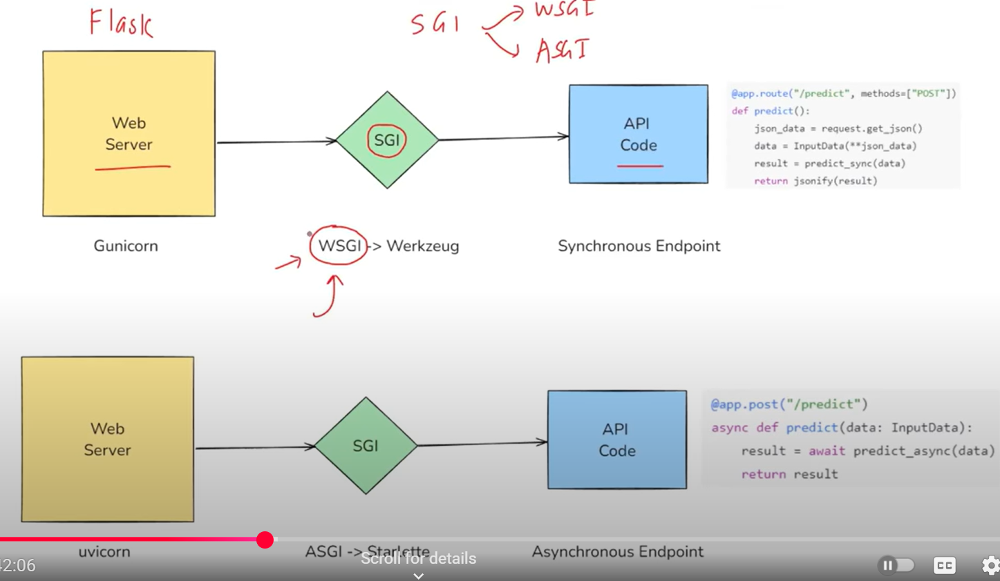

# 📘 FastAPI Basic Guide

## Introduction

**FastAPI** is a modern and fast (high-performance) web framework for building APIs with Python 3.7+ based on **standard Python type hints**. It is designed to help developers build APIs quickly, with minimal code, and comes with powerful features like data validation, automatic documentation, and support for asynchronous programming.


---

## Why Use FastAPI?

-  **Fast**: Built on Starlette and Pydantic, making it one of the fastest Python frameworks.
- **Automatic Docs**: Get Swagger UI and ReDoc automatically for your API.
- **Type Hints = Validation**: Uses Python type hints for request validation and editor support.
- **Async Support**: Easily write asynchronous code with `async` and `await`.
- **Clean Code**: Encourages readable and concise code for web APIs.

---

## Why FastAPI is Fast to Run?

FastAPI is designed to be extremely performant, and the image below explains the flow of how FastAPI handles an incoming API request efficiently.


### Request Flow Explanation

1. **Web Server**: The client (browser or another service) sends an HTTP request to the web server.
2. **SGI (ASGI)**: FastAPI uses **ASGI** (Asynchronous Server Gateway Interface) instead of WSGI, which allows for asynchronous, non-blocking request handling — making it faster and more scalable.
3. **API Code**: Once the request reaches the FastAPI application:
   - It parses the request using Pydantic and Python type hints.
   - It directly extracts values using `.json()` with almost no overhead.
   - The logic (e.g., a machine learning model or database call) is executed.
4. **Response**: The result (e.g., a prediction) is sent back as a JSON response with minimal latency.


## Installation

Install FastAPI and an ASGI server like `uvicorn`:

``pip install fastapi uvicorn pydantic``

## Run server:
``uvicorn main:app --reload``
---

## 🆚 FastAPI vs Flask

The diagram below highlights the architectural and functional differences between **Flask** and **FastAPI**, especially in how they handle requests.



### 🔍 Key Differences

| Feature                     | Flask                                  | FastAPI                                 |
|----------------------------|----------------------------------------|------------------------------------------|
| **Interface Standard**     | WSGI (Web Server Gateway Interface)     | ASGI (Asynchronous Server Gateway Interface) |
| **Request Handling**       | Synchronous                            | Asynchronous (Async/Await)               |
| **Server**                 | Gunicorn + Werkzeug                    | Uvicorn + Starlette                      |
| **Speed**                  | Slower (synchronous blocking)          | Faster (non-blocking, async I/O)         |
| **Code Style**             | Traditional function-based             | Async function support out of the box    |
| **Built-in Docs**          | Not automatic                        | Swagger UI & ReDoc                    |
| **Data Validation**        |  Manual using libraries like Marshmallow | Automatic via Pydantic                |
| **Type Hints Support**     |  Optional                            | Strongly enforced                      |
| **Best Use Case**          | Simple projects, smaller APIs          | Modern APIs, high-performance services   |

---

### Example Request & Response

#### Incoming Request:
```http
POST /predict HTTP/1.1
Host: api.example.com
Content-Type: application/json
Content-Length: 45

{
  "feature1": 5.2,
  "feature2": 3.1
}

Internal FastAPI Handling:
Request.method  -->  "POST"
Request.url     -->  "/predict"
Request.json()  -->  {"feature1": 5.2, "feature2": 3.1}

Response:
HTTP/1.1 200 OK
Content-Type: application/json

{
  "prediction": 8.3
}

